# StockManager — Class Diagram

> Generated from source. Arrows: `-->` association, `..>` dependency, `*--` composition.

```mermaid
classDiagram
    %% ─────────────────────────────────────────────────────────
    %% DOMAIN MODELS
    %% ─────────────────────────────────────────────────────────

    class Broker {
        +String id
        +String name
        +String? notes
        +copyWith() Broker
    }

    class Stock {
        +String id
        +String? brokerId
        +String isin
        +String symbol
        +String name
        +String exchange
        +String currency
        +bool dripEnabled
        +copyWith() Stock
    }

    class StockTransaction {
        +String id
        +String stockId
        +TransactionType type
        +DateTime executedAt
        +Decimal shares
        +Decimal pricePerShare
        +String currency
        +Decimal fees
        +String? notes
        +totalCost() Decimal
        +copyWith() StockTransaction
    }

    class TransactionType {
        <<enumeration>>
        buy
        sell
    }

    class StockSplit {
        +String id
        +String stockId
        +DateTime date
        +Decimal fromShares
        +Decimal toShares
        +ratio() Decimal
    }

    class Dividend {
        +String id
        +String stockId
        +DividendType type
        +DateTime date
        +Decimal? amountPerShare
        +Decimal totalAmount
        +String currency
        +Decimal withholdingTax
        +String? notes
        +netAmount() Decimal
        +copyWith() Dividend
    }

    class DividendType {
        <<enumeration>>
        paid
        expected
    }

    class PriceQuote {
        +String stockId
        +Decimal price
        +String currency
        +DateTime fetchedAt
        +bool isStale
        +withStaleness() PriceQuote
    }

    class ExchangeRate {
        +String base
        +String target
        +Decimal rate
        +DateTime fetchedAt
        +bool isManualOverride
        +isStale() bool
        +convert(Decimal amount) Decimal
    }

    class AppSettings {
        +String preferredCurrency
        +String? nextcloudUrl
        +String? nextcloudUsername
        +String? nextcloudPath
        +AppTheme theme
        +bool notificationsEnabled
        +Decimal priceAlertThresholdPct
        +int dividendAlertDays
        +DateTime? lastSyncAt
        +copyWith() AppSettings
        +defaults()$ AppSettings
    }

    class AppTheme {
        <<enumeration>>
        system
        light
        dark
    }

    %% Domain associations
    Stock "many" --> "0..1" Broker : belongs to
    StockTransaction "many" --> "1" Stock : belongs to
    StockTransaction --> TransactionType
    StockSplit "many" --> "1" Stock : belongs to
    Dividend "many" --> "1" Stock : belongs to
    Dividend --> DividendType
    PriceQuote --> Stock : cached for
    AppSettings --> AppTheme

    %% ─────────────────────────────────────────────────────────
    %% CALCULATORS
    %% ─────────────────────────────────────────────────────────

    class PortfolioCalculator {
        +calculate(txs, splits) PositionSummary
    }

    class PositionSummary {
        +Decimal sharesHeld
        +Decimal avgBuyPrice
        +Decimal totalInvested
    }

    class PnlCalculator {
        +calculate(txs, splits, quote) PnlResult
        +convert(result, rate) PnlResult
    }

    class PnlResult {
        +Decimal unrealisedPnl
        +Decimal unrealisedPnlPct
        +Decimal realisedPnl
        +Decimal currentValue
        +Decimal totalInvested
    }

    class DividendCalculator {
        +calculate(dividends, price, shares) DividendSummary
        +convert(summary, rate) DividendSummary
        +estimatedTotal() Decimal
    }

    class DividendSummary {
        +Decimal allTimeTotal
        +Decimal currentYearTotal
        +Decimal annualYieldPct
    }

    %% Calculator dependencies and outputs
    PortfolioCalculator ..> StockTransaction : consumes
    PortfolioCalculator ..> StockSplit : consumes
    PortfolioCalculator --> PositionSummary : produces

    PnlCalculator ..> StockTransaction : consumes
    PnlCalculator ..> StockSplit : consumes
    PnlCalculator ..> PriceQuote : consumes
    PnlCalculator ..> ExchangeRate : converts via
    PnlCalculator --> PnlResult : produces

    DividendCalculator ..> Dividend : consumes
    DividendCalculator ..> ExchangeRate : converts via
    DividendCalculator --> DividendSummary : produces

    %% ─────────────────────────────────────────────────────────
    %% SERVICES
    %% ─────────────────────────────────────────────────────────

    class MarketDataService {
        +fetchQuote(symbol, stockId) PriceQuote
        +fetchQuotes(symbolMap) Map
    }

    class CurrencyService {
        +fetchRates(baseCurrency) List~ExchangeRate~
    }

    class IsinLookupService {
        +lookup(isin) IsinLookupResult
    }

    class IsinLookupResult {
        +String symbol
        +String name
        +String exchange
        +String currency
    }

    class NotificationService {
        +initialize()
        +showPriceAlert(stock, quote)
        +showDividendAlert(stock, dividend)
        +cancelAll()
    }

    class NextcloudService {
        +upload(path, data)
        +listFiles(path) List
        +delete(path)
        +fetchCertificateInfo(url) CertificateInfo
        +pinCertificate(fingerprint)
        +unpinCertificate()
    }

    %% Service outputs
    MarketDataService --> PriceQuote : produces
    CurrencyService --> ExchangeRate : produces
    IsinLookupService --> IsinLookupResult : produces
    NotificationService ..> Stock : alerts on
    NotificationService ..> PriceQuote : alerts on
    NotificationService ..> Dividend : alerts on

    %% ─────────────────────────────────────────────────────────
    %% DATABASE LAYER
    %% ─────────────────────────────────────────────────────────

    class AppDatabase {
        +schemaVersion = 1
        +brokersDao BrokersDao
        +stocksDao StocksDao
        +transactionsDao TransactionsDao
        +dividendsDao DividendsDao
        +settingsDao SettingsDao
        +forTesting(executor)$ AppDatabase
    }

    class BrokersDao {
        +watchAll() Stream~List~Broker~~
        +getAll() Future~List~Broker~~
        +findById(id) Future~Broker~~
        +upsert(broker) Future
        +deleteById(id) Future
        +count() Future~int~
    }

    class StocksDao {
        +watchAll() Stream~List~Stock~~
        +getAll() Future~List~Stock~~
        +findById(id) Future~Stock~~
        +findByIsin(isin) Future~Stock~~
        +upsert(stock) Future
        +deleteById(id) Future
        +getCachedPrice(id) Future~PriceQuote~~
        +getAllCachedPrices() Future~List~PriceQuote~~
        +upsertPrice(quote) Future
        +getSplitsForStock(id) Future~List~StockSplit~~
        +upsertSplit(split) Future
        +deleteSplit(id) Future
    }

    class TransactionsDao {
        +watchByStock(id) Stream~List~StockTransaction~~
        +getByStock(id) Future~List~StockTransaction~~
        +getAll() Future~List~StockTransaction~~
        +findById(id) Future~StockTransaction~~
        +insert(tx) Future
        +updateRow(tx) Future
        +deleteById(id) Future
    }

    class DividendsDao {
        +watchByStock(id) Stream~List~Dividend~~
        +getByStock(id) Future~List~Dividend~~
        +getPaid() Future~List~Dividend~~
        +getExpected() Future~List~Dividend~~
        +getAll() Future~List~Dividend~~
        +insert(div) Future
        +updateRow(div) Future
        +deleteById(id) Future
    }

    class SettingsDao {
        +watchSettings() Stream~AppSettings~
        +getSettings() Future~AppSettings~
        +upsertSettings(settings) Future
        +watchExchangeRates() Stream~List~ExchangeRate~~
        +getExchangeRates() Future~List~ExchangeRate~~
        +getRate(base, target) Future~ExchangeRate~~
        +upsertRate(rate) Future
        +deleteRate(base, target) Future
    }

    %% Database composition
    AppDatabase *-- BrokersDao
    AppDatabase *-- StocksDao
    AppDatabase *-- TransactionsDao
    AppDatabase *-- DividendsDao
    AppDatabase *-- SettingsDao

    %% DAO → domain model mapping
    BrokersDao ..> Broker : maps rows to
    StocksDao ..> Stock : maps rows to
    StocksDao ..> PriceQuote : maps rows to
    StocksDao ..> StockSplit : maps rows to
    TransactionsDao ..> StockTransaction : maps rows to
    DividendsDao ..> Dividend : maps rows to
    SettingsDao ..> AppSettings : maps rows to
    SettingsDao ..> ExchangeRate : maps rows to
```



---

## Riverpod Provider Graph

```
databaseProvider ──────────────────────────────────────────────┐
                                                                │
brokersStreamProvider ←── BrokersDao.watchAll()                │
stocksStreamProvider  ←── StocksDao.watchAll()                 │
stocksProvider        ←── StocksDao.getAll()                   ├── AppDatabase
transactionsByStock   ←── TransactionsDao.watchByStock(id)     │
dividendsByStock      ←── DividendsDao.watchByStock(id)        │
settingsStreamProvider←── SettingsDao.watchSettings()          │
exchangeRatesProvider ←── SettingsDao.getExchangeRates()       │
splitsByStockProvider ←── StocksDao.getSplitsForStock(id)      │
                                                                ┘

priceQuotesProvider  ← StateProvider (in-memory, refreshed on demand)

portfolioSummaryProvider (FutureProvider)
  ├── stocksProvider
  ├── brokersProvider
  ├── settingsProvider
  ├── exchangeRatesProvider
  ├── priceQuotesProvider
  ├── transactionsByStockProvider (per stock)
  ├── splitsByStockProvider      (per stock)
  └── dividendsByStockProvider   (per stock)
       │
       ├── PortfolioCalculator.calculate()
       ├── PnlCalculator.calculate() + convert()
       └── DividendCalculator.calculate() + convert()

stockActionsProvider  ─── StockActions  (addStock, updateStock, deleteStock,
                                         addTransaction, deleteTransaction,
                                         addDividend, deleteDividend)

settingsActionsProvider ─ SettingsActions (saveSettings, setManualRate,
                                           deleteRate, cacheRates)
```

---

## Navigation Tree

```
ShellRoute (AdaptiveShell)
│
├── /                              DashboardScreen
│
├── /stocks                        StocksScreen
│   ├── /stocks/add                AddStockScreen
│   └── /stocks/:id                StockDetailScreen
│       ├── /stocks/:id/edit       EditStockScreen
│       ├── /stocks/:id/transactions/add   AddTransactionScreen
│       └── /stocks/:id/dividends/add      AddDividendScreen
│
├── /dividends                     DividendsScreen
│
├── /brokers                       BrokersScreen
│   ├── /brokers/add               AddBrokerScreen
│   └── /brokers/:id/edit          EditBrokerScreen
│
└── /settings                      SettingsScreen
    ├── /settings/nextcloud        NextcloudSettingsScreen
    ├── /settings/currency         CurrencySettingsScreen
    └── /settings/notifications    NotificationSettingsScreen
```
